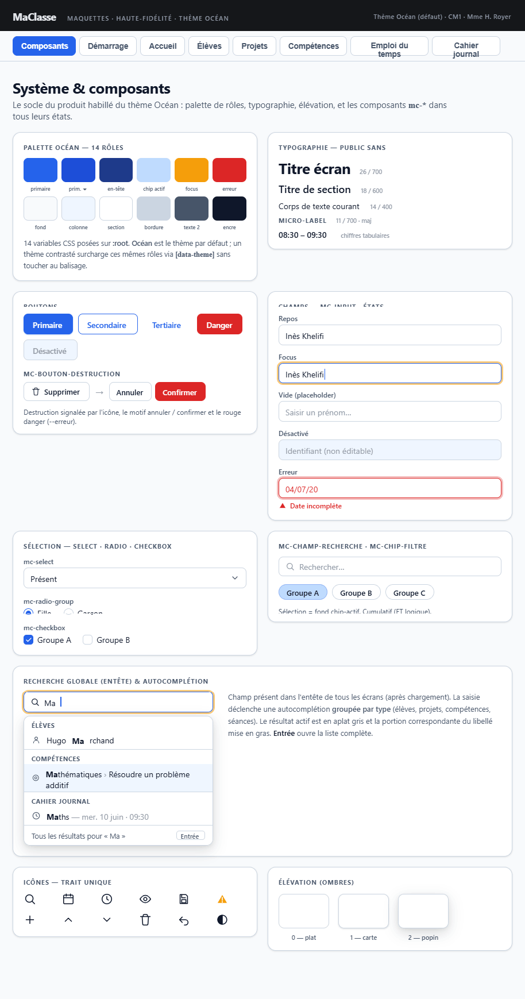

## Maquette

**Cohérence** : palette de couleurs, typographie, boutons (Primaire / Secondaire / Tertiaire / Danger), composants de formulaire (mc-input, mc-textarea, mc-select, mc-radio-group, mc-checkbox, mc-champ-heure), chips et sélecteur multi-groupes — tout correspond à la spécification.

---

## Principes

- Tous les composants respectent les conventions Angular 21 : standalone, OnPush, `input()`/`output()`, `inject()`
- Les composants de formulaire implémentent `ControlValueAccessor` pour s'intégrer avec les Reactive Forms
- Chaque composant enforce automatiquement :
  - L'`id` HTML lowerCamelCase (passé en `input()` obligatoire)
  - Les attributs ARIA nécessaires (label, describedby, required…)
  - Le préfixe CSS `mc-` et les variables CSS (aucune couleur hardcodée)

---

## Composants simples unitaires — Formulaires

Ces composants wrappent les éléments natifs HTML pour centraliser le style et l'accessibilité.

| Composant | Élément natif | Usage principal |
|---|---|---|
| `mc-input` | `<input>` | Champs texte, date, nombre dans tous les formulaires |
| `mc-textarea` | `<textarea>` | Saisies libres longues (constat PPI, appréciation bulletin…) |
| `mc-checkbox` | `<input type="checkbox">` | Cases à cocher (groupes, options…) |
| `mc-select` | `<select>` | Listes déroulantes (statut, discipline, niveau…) |
| `mc-radio-group` | `<input type="radio">` groupés | Choix exclusifs (parité semaine, sexe…) |
| `mc-champ-heure` | `<input type="time">` | Saisie HH:MM (horaires séances, absences récurrentes…) |

---

## Composants simples unitaires — Affichage

| Composant | Description | Utilisé dans |
|---|---|---|
| `mc-chip-filtre` | Chip cliquable avec état actif/inactif, libellé | Filtrage par domaine (Compétences), potentiellement Projets |
| `mc-badge-statut` | Affiche un statut d'acquisition (A/EC/NA/NE) avec glyphe, couleur texte et fond | PPI, Bulletin, Tableau de bord |
| `mc-champ-recherche` | Input texte avec icône loupe et bouton reset | Élèves, Projets, Compétences |
| `mc-bouton-destruction` | Bouton SUPPRIMER qui se masque au clic pour afficher ANNULER + CONFIRMER (pas de popin). Accepte un `input() disabled` : quand désactivé, affiche un tooltip et un `aria-describedby` expliquant pourquoi (ex. "valeur utilisée") | Fiche élève, fiche projet, séance CJ, référentiels paramétrage |

---

## Composants riches

### `mc-selecteur-competences`

- Sélecteur de compétences **autocomplete** : filtre par domaine via chips + champ de saisie avec suggestions (libellé complet "domaine › sous-domaine › …") + compétences sélectionnées affichées en chips avec bouton de suppression (✕)
- Permet la sélection mono ou multi-compétences
- Utilisé dans : Projets (période), Cahier journal (séance)

### `mc-arbre-competences`

- Arbre de compétences filtrable : champ `mc-champ-recherche` + chips de domaine `mc-chip-filtre` + arbre repliable navigation clavier WAI-ARIA Tree View (ArrowDown/Up/Left/Right/Home/End)
- Permet la sélection mono ou multi-compétences
- Utilisé dans : **écran Compétences uniquement**

### `mc-eleves-concernes`

- Composant de sélection du périmètre d'élèves concernés par une séance ou un créneau
- Trois modes exclusifs via `mc-radio-group` : *Toute la classe* / *Par groupe* / *Élèves spécifiques*
- En mode groupe : chips des groupes du référentiel (sélection multiple)
- En mode élèves : chips des élèves de la classe (sélection multiple)
- Expose `input()` pour la valeur initiale et `output()` sur changement
- Utilisé dans : Cahier journal (formulaire séance), Emploi du temps (formulaire créneau)

### `mc-mini-calendrier`

- Calendrier mensuel miniature navigable (mois précédent/suivant)
- Met en évidence les jours ayant une entrée dans le cahier journal
- **Grise** les jours weekend (samedi/dimanche)
- **Grise** les jours fériés (issus de `referentiels.joursFeries`)
- **Grise** les jours non ouvrés (non présents dans `referentiels.configEmploiDuTemps.joursOuvres`)
- Émet la date sélectionnée via `output()`
- Utilisé dans : Cahier journal (colonne gauche)

---

## Popins

Répertoire `popin/` avec une classe de base commune (`PopinBase` ou directive partagée) gérant :
- Gestion du focus (`[mcAutoFocus]`) à l'ouverture
- Fermeture par Échap si applicable
- Trap du focus dans la modale (RGAA)

### Popins fonctionnelles

| Composant | Déclencheur | Contenu |
|---|---|---|
| `popin-demarrage` | Automatique au lancement sans données | Choix : charger ZIP+mdp / nouveau fichier depuis défaut |
| `popin-sauvegarde` | Clic SAUVEGARDER (première fois) | Saisie du mot de passe de chiffrement |
| `popin-warnings-absences` | Clic sur triangle orange (EDT ou CJ) | Liste des conflits de la séance/créneau concerné (non bloquant, bouton Fermer) |
| `popin-avertissement` | Formulaire non enregistré + action de navigation | Message d'avertissement + boutons ANNULER / CONFIRMER (Élèves, Projets) |
| `popin-export-competences` | Clic "Envoyer vers un projet" ou "Envoyer vers une séance" | Deux `mc-select` en cascade (projet/jour puis période/séance) + ANNULER / CONFIRMER |

---

## Composant d'en-tête

### `mc-entete`

Emplacement : `composants/mc-entete/` (partagé conceptuellement avec tous les écrans, instancié une seule fois dans `app.ts`).

**Aucun `input()` ni `output()`** — injecte directement les services nécessaires :

| Service injecté | Usage |
|---|---|
| `DonneesService` | Signals `peutAnnuler`, `peutRefaire`, `aDonneesModifiees` |
| `ContexteService` | `themeActif`, `motDePasse` |
| `SauvegardeAutoService` | `dateDerniereSauvegarde` (tooltip du bouton SAUVEGARDER) |
| `ChiffrementService` | Sauvegarde manuelle |
| `RechercheGlobaleService` | Filtrage temps réel des résultats de recherche |
| `Router` | Navigation au clic sur un résultat de recherche |

**Zones internes :**

| Zone | Contenu | Condition d'affichage |
|---|---|---|
| Logo | Logo + "MaClasse" | Toujours |
| Navigation | Boutons d'écrans (`routerLink`, état actif via `routerLinkActive`) | Données chargées |
| Recherche | Champ `mc-champ-recherche` + liste d'autocomplétion | Données chargées |
| Actions | SAUVEGARDER (tooltip horodatage) + ANNULER + REFAIRE | Données chargées |
| Thème | Bouton bascule thème (cycle parmi les 5 thèmes) | Toujours |

SAUVEGARDER :
- Premier clic → ouvre `popin-sauvegarde` (saisie du mot de passe)
- Clics suivants → sauvegarde directe (mot de passe déjà en `ContexteService.motDePasse`)
- Tooltip : `LIBELLES.entete.tooltipDerniereSauvegarde` + horodatage, ou `LIBELLES.entete.tooltipAucuneSauvegarde`

---

## CSS mutualisés (non composants)

- **Layout liste+détail** : classes CSS utilitaires (`mc-layout-liste-detail`, `mc-colonne-gauche`, `mc-colonne-droite`) appliquées dans les écrans Élèves et Projets pour obtenir un rendu visuel homogène sans composant dédié
