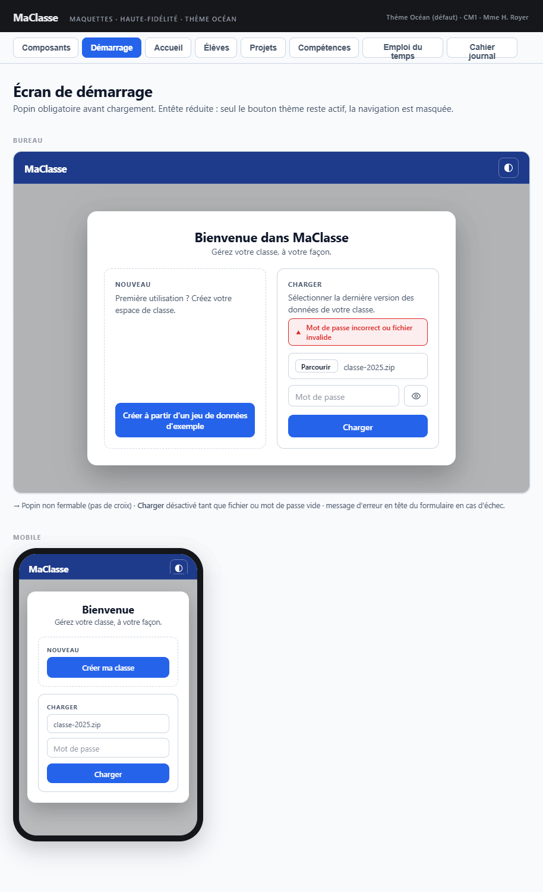

## Maquette

**Cohérence globale** : popin non fermable, layout bureau (2 colonnes côte à côte), layout mobile (sections empilées), message d'erreur rouge en haut du formulaire, champ fichier + mot de passe + bouton œil, bouton CHARGER désactivé si vide — tout correspond.

**Libellé mobile** : le bouton affiche **"Créer ma classe"** (raccourci mobile) vs **"Créer ma classe à partir d'un jeu de données d'exemple"** (desktop) — intentionnel, documenté dans la spec.

---

## Contexte

Affiché au lancement de l'application quand aucune donnée n'est chargée en mémoire.
Gardé par `DonneesChargeesGarde` pour tous les écrans applicatifs.

---

## Entête

Toujours visible, même sans données chargées.

| Élément | État |
|---|---|
| Logo + titre "MaClasse" | Visible |
| Bouton changement de thème | **Actif** |
| Boutons de navigation (écrans) | **Masqués** |
| Bouton SAUVEGARDER | **Masqué** |
| Boutons ANNULER / REFAIRE | **Masqués** |

---

## Popin de démarrage

- **Obligatoire** : s'affiche automatiquement, non fermable (pas de croix de fermeture)
- **Titre** : *"Bienvenue dans MaClasse — gérez votre classe, à votre façon."*
- **Layout** :
  - PC : deux zones côte à côte (Nouveau à gauche, Charger à droite)
  - Mobile : deux zones empilées (Nouveau en haut, Charger en bas)

---

## Zone "Nouveau" (gauche / haut)

| Élément | Détail |
|---|---|
| Titre de zone | *"Première utilisation ? Créez votre espace de classe."* |
| Bouton **"Créer ma classe à partir d'un jeu de données d'exemple"** (PC) / **"Créer ma classe"** (mobile) | Charge `public/donnees-defaut.json`, transition immédiate vers l'écran d'accueil |

---

## Zone "Charger" (droite / bas)

| Élément | Détail |
|---|---|
| Titre de zone | *"Sélectionner la dernière version des données de votre classe"* |
| Zone de message d'erreur | En haut du formulaire, visible uniquement en cas d'erreur (mauvais mot de passe, fichier corrompu ou invalide) |
| Champ upload | Sélection d'un fichier ZIP chiffré (type `file`, accept `.zip`) |
| Champ mot de passe | `mc-input` de type password, label *"Mot de passe"* |
| Bouton œil | Afficher / masquer le mot de passe (bascule `type="password"` ↔ `type="text"`) |
| Bouton **CHARGER** | Déclenche le déchiffrement AES-GCM via `ChiffrementService` |

### Comportement du bouton CHARGER

- **Désactivé** si le champ fichier ou le mot de passe est vide
- **Au clic** (si fichier et mot de passe renseignés) :
  - Le bouton est immédiatement **désactivé** (évite le double-clic)
  - Le libellé du bouton est remplacé par un **spinner + texte "Chargement…"** (pendant le déchiffrement AES-GCM)
- En cas d'erreur : affiche le message d'erreur en haut du formulaire, réactive le bouton, reste sur la popin
- En cas de succès :
  - Données chargées dans `DonneesService`
  - Mot de passe conservé en mémoire dans `ContextService` (pour la sauvegarde ultérieure)
  - Transition immédiate vers l'écran d'accueil

---

## Après chargement réussi (les deux zones)

- La popin se ferme
- L'entête affiche les boutons de navigation, SAUVEGARDER, ANNULER, REFAIRE
- L'utilisateur est redirigé vers l'écran d'accueil
- Aucun indicateur de chargement (transition immédiate)
