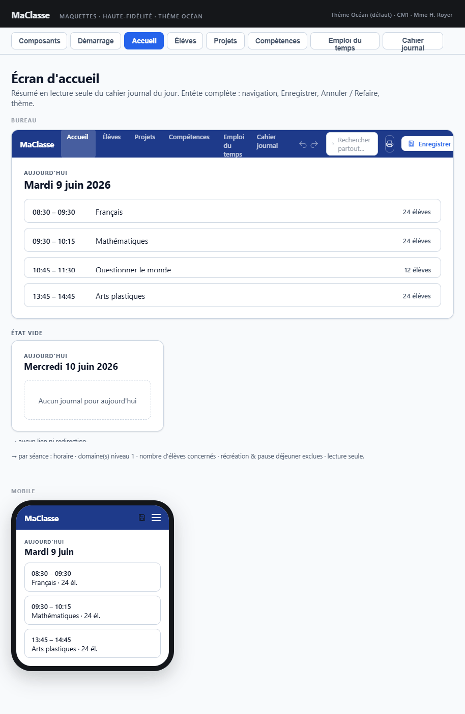

## Maquette

**Cohérence globale** : date du jour, séances filtrées (récréation et pause déjeuner exclues), affichage par séance (horaire + domaine niveau 1 + nombre d'élèves), lecture seule, état vide "Aucun journal pour aujourd'hui", absence de lien de navigation vers le CJ — tout correspond.

**Format de date** : la maquette sépare en deux éléments (label `AUJOURD'HUI` + titre de date sans tiret) — intentionnel, documenté dans la spec.

---

## Contexte

Écran affiché par défaut après le chargement des données. Vue purement informative, aucune interaction de modification.

---

## Entête (état sur cet écran)

| Élément | État |
|---|---|
| Logo + titre "MaClasse" | Visible |
| Bouton de navigation "Accueil" | **Actif** — couleur légèrement différente des autres boutons |
| Autres boutons de navigation | Visibles, couleur normale |
| Bouton SAUVEGARDER | Visible |
| Boutons ANNULER / REFAIRE | Visibles, activés/désactivés selon l'état des piles |
| Bouton changement de thème | Actif |

---

## Contenu de l'écran

Pas de titre d'écran affiché — l'écran actif est identifiable via le bouton de navigation.

### Date du jour

- Rendu en deux niveaux :
  - Label caption **"AUJOURD'HUI"** (petite casse, style secondaire)
  - Titre **"lundi 9 juin 2026"** (sans tiret)
- Calculée via `DateUtils`

### Résumé du cahier journal du jour

#### Cas — aucune entrée pour aujourd'hui

- Message : *"Aucun journal pour aujourd'hui"*
- Aucun lien ni bouton de redirection

#### Cas — entrée existante

Liste des séances de la journée, **filtrées** (récréation et pause déjeuner exclues), dans l'ordre chronologique.

Pour chaque séance :

| Champ | Détail |
|---|---|
| Heure de début / heure de fin | Format "HH:MM – HH:MM" |
| Nombre d'élèves | Nombre d'élèves concernés par la séance (`elevesConcernes`) |
| Domaine(s) de compétences | Libellé(s) texte du ou des domaines (niveau 1 de l'arbre), séparés par une virgule |

- Vue en lecture seule, aucun lien vers le cahier journal
- Aucune interaction utilisateur sur les séances

---

## Contrainte métier (validation `CahierJournalService`)

- Plusieurs séances peuvent se chevaucher sur un même créneau horaire
- Un élève ne peut pas être affecté à plus d'une séance simultanément
- Cette règle est vérifiée lors de l'enregistrement d'une séance dans `CahierJournalService`
