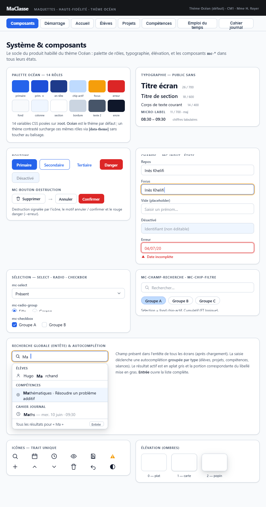

## Maquette

**Cohérence** : palette de couleurs, typographie, boutons (Primaire / Secondaire / Tertiaire / Danger), composants de formulaire (mc-input, mc-textarea, mc-select, mc-radio-group, mc-champ-heure), chips et sélecteur multi-groupes — tout correspond à la spécification. La case à cocher de la maquette n'a pas de composant dédié : les rares cases à cocher (section Domaines du paramétrage) sont natives.

---

## Principes

- Tous les composants respectent les conventions Angular du projet (`.claude/rules/angular-typescript.md`) : standalone, OnPush, `input()`/`output()`, `inject()`
- Tout composant de `composants/` étend `ComposantBase`, qui expose `LIBELLES` aux templates
- Les composants de formulaire implémentent `ControlValueAccessor` (via `ChampBase`) pour s'intégrer aux Reactive Forms
- Chaque composant garantit :
  - L'`id` HTML lowerCamelCase (passé en `input()`)
  - Les attributs ARIA nécessaires (label, describedby, required…)
  - Le préfixe CSS `mc-` et les variables CSS (aucune couleur hardcodée)

---

## Classe de base `ChampBase`

Classe abstraite (`champ-base.ts`, étend `ComposantBase`) portant l'implémentation commune de `ControlValueAccessor` des champs à valeur textuelle : `mc-input`, `mc-textarea`, `mc-select`, `mc-radio-group`, `mc-champ-heure`.

| Membre | Rôle |
|---|---|
| `valeur` | Signal de la valeur courante (chaîne ; `null`/`undefined` reçus deviennent `''`) |
| `estDesactive` | Signal de l'état désactivé, piloté par le `FormControl` parent (`setDisabledState`) |
| `writeValue`, `registerOnChange`, `registerOnTouched`, `setDisabledState` | Interface `ControlValueAccessor` ; `onChange` accepte `null` pour une valeur vidée (EFFACER de `mc-radio-group`) |
| `surChangement(valeur)` | Lié à `(input)` : mémorise la valeur et notifie Angular Forms en temps réel |
| `surBlur()` | Lié à `(blur)` : notifie Angular Forms que le champ a été touché |

---

## Composants simples unitaires — Formulaires

Ces composants encapsulent les éléments natifs HTML pour centraliser le style et l'accessibilité.

| Composant | Élément natif | Usage principal |
|---|---|---|
| `mc-input` | `<input>` | Champs texte, date, nombre, couleur dans tous les formulaires |
| `mc-textarea` | `<textarea>` | Saisies libres longues (fiche élève, projet, séance, notes de la journée) |
| `mc-select` | `<select>` | Listes déroulantes : type de créneau et de séance, jour d'un créneau, **fréquence d'un EDT et d'un EDT calculé**, **parité d'une absence récurrente**, champs de la fiche élève, popin d'export |
| `mc-radio-group` | `<input type="radio">` groupés | Choix exclusifs : sexe de l'élève, mode de `mc-eleves-concernes`, réponses aux autorisations et latéralité de l'élève (effaçables) |
| `mc-champ-heure` | `<input type="time">` | Saisie HH:MM (séances, temps de créneau, absences récurrentes, journée scolaire). Input `descriptionIds` (`aria-describedby` du champ natif, ex. message d'erreur de plage horaire) |

### Inputs de `mc-input`

| Input | Défaut | Rôle |
|---|---|---|
| `id`, `label` | requis | `id` du champ natif (suffixé `-input`) et libellé du `<label>` associé |
| `type` | `'text'` | Type HTML ; pour `number`, la valeur transmise au modèle est un nombre |
| `placeholder`, `required`, `min`, `max` | `''`, `false`, `null`, `null` | Attributs natifs correspondants (astérisque visuel si `required`) |
| `lectureSeule` | `false` | Attribut `readonly` : le champ reste focalisable et lisible par les lecteurs d'écran (contrairement à `disabled`), avec un fond distinct. Utilisé pour l'identifiant d'une valeur enregistrée du Paramétrage |
| `infobulle` | `''` | Attribut `title` du champ natif (aucun si vide) |
| `descriptionIds` | `null` | `aria-describedby` du champ natif : identifiants, séparés par des espaces, du message d'erreur ou du texte explicatif placé par le parent |

### Inputs de `mc-radio-group`

| Input | Défaut | Rôle |
|---|---|---|
| `id`, `label` | requis | `name` commun des radios et préfixe de leurs `id` (`<id>_<valeur>`) ; libellé du `<legend>` |
| `options` | `[]` | Options `{ valeur, libelle }` |
| `required` | `false` | Attribut `required` des radios (astérisque visuel) |
| `effacable` | `false` | Réponse remise à « non renseignée » possible : tant qu'une option est cochée, un bouton **EFFACER** (`btnEffacer_<id>`, `mc-btn-fantome mc-btn-xs`, `aria-label` « Effacer la réponse : *libellé* ») décoche toutes les options, transmet `null` au `FormControl` et rend le focus à la première option. Un radio natif ne peut pas être décoché autrement |

---

## Composants simples unitaires — Affichage

| Composant | Description | Utilisé dans |
|---|---|---|
| `mc-chip-filtre` | Chip cliquable avec état actif/inactif, libellé | Filtres (Élèves, Projets, arbre des compétences), disciplines (séance, temps de créneau), sources d'un EDT calculé, jours ouvrés (Paramétrage), sélections multiples des formulaires |
| `mc-badge-statut` | Affiche un statut d'acquisition avec glyphe, couleur de texte et fond | Paramétrage : aperçu en temps réel du barème. Destiné aussi à PPI, Bulletin et Tableau de bord (phase 2) |
| `mc-champ-recherche` | Input texte avec icône loupe et bouton reset ; `delaiMs` optionnel pour différer l'émission | Élèves, Projets, `mc-arbre-competences`, recherche globale de l'entête (300 ms) |
| `mc-bouton-destruction` | Bouton SUPPRIMER qui se masque au clic pour afficher ANNULER + CONFIRMER (pas de popin) | Fiche élève et fiche projet, périodes et lignes des formulaires, propriétés d'un EDT, créneau et temps d'un créneau, EDT calculé, référentiels du paramétrage |
| `mc-pastilles-eleves-concernes` | Pastilles statiques `.mc-disc-pill` du périmètre d'une séance ou d'un temps de créneau : « Classe », groupes ou élèves (libellés résolus via `DonneesService`) ; rien pour un périmètre absent | Cahier journal (liste des séances), Emploi du temps (cellules de la grille) |

### Inputs de `mc-bouton-destruction`

| Input | Rôle |
|---|---|
| `idBase` (obligatoire) | Préfixe des `id` des boutons internes (SUPPRIMER, ANNULER, CONFIRMER) |
| `desactive` | Désactive le bouton SUPPRIMER (ex. valeur de référentiel utilisée) |
| `tooltipDesactive` | Explication affichée en tooltip et dans un `` relié par `aria-describedby` quand le bouton est désactivé |
| `petit` | Taille réduite `mc-btn-sm` (formulaires, listes) |

Output `confirme` : émis au clic sur CONFIRMER.

Une séance du cahier journal se supprime par ✕, sans ce composant (suppression immédiate, annulable par UNDO).

---

## Composants riches

### `mc-selecteur-competences`

- Sélecteur de compétences **autocomplete** : filtre par domaine via chips + champ de saisie avec suggestions (libellé complet « domaine › sous-domaine › … ») + compétences sélectionnées affichées en chips avec bouton de suppression (✕)
- Permet la sélection mono ou multi-compétences
- Utilisé dans : Projets (période), Cahier journal (séance)

### `mc-arbre-competences`

- Arbre de compétences filtrable : champ `mc-champ-recherche` + chips de domaine `mc-chip-filtre` + arbre repliable avec navigation clavier WAI-ARIA Tree View (ArrowDown/Up/Left/Right/Home/End)
- Affiche les domaines retournés par `CompetenceService.obtenirDomaines()` (domaines actifs)
- Utilisé dans : **écran Compétences uniquement** (placé dans `composants/` par choix assumé)

### `mc-eleves-concernes`

- Sélection du périmètre d'élèves concernés par une séance ou un temps de créneau
- Trois modes exclusifs via `mc-radio-group` : *Toute la classe* / *Par groupe* / *Élèves spécifiques*
- En mode groupe : chips des groupes du référentiel (sélection multiple)
- En mode élèves : chips des élèves de la classe (sélection multiple)
- Input facultatif `elevesIndisponiblesIds` (vide par défaut) : en mode élèves, le chip d'un élève indisponible **non sélectionné** est désactivé, avec la mention « absent ce jour » (infobulle + texte `sr-only`) ; un élève déjà sélectionné reste retirable. Alimenté par le cahier journal (absences ponctuelles du jour), pas par l'EDT
- `ControlValueAccessor` : valeur `ElevesConcernes`
- Utilisé dans : Cahier journal (formulaire de séance), Emploi du temps (formulaire de créneau et d'EDT calculé)

### `mc-mini-calendrier`

- Calendrier mensuel miniature navigable (mois précédent/suivant)
- Met en évidence les jours ayant une entrée dans le cahier journal, le jour sélectionné et aujourd'hui
- **Grise et désactive** les jours de week-end, les jours fériés (`referentiels.joursFeries`) et les jours non ouvrés (absents de `referentiels.configEmploiDuTemps.joursOuvres`)
- Inputs `dateMin` / `dateMax` (date ISO, `null` = sans borne) : **limitent uniquement la navigation entre les mois**. Le bouton mois précédent est désactivé quand le mois affiché est celui de `dateMin`, le bouton mois suivant quand c'est celui de `dateMax`. Les jours d'un mois affiché ne sont pas bornés : dans le mois de `dateMin`, un jour antérieur à `dateMin` reste cliquable
- Le mois affiché suit `jourSelectionne` quand celui-ci change (y compris hors des bornes)
- Émet la date sélectionnée via `output()`
- Utilisé dans : Cahier journal (colonne gauche)

---

## Popins

Répertoire `composants/popins/`. Chaque popin est un `<dialog>` natif ouvert par `showModal()`.

### Classe de base `PopinBase`

Classe abstraite (`popin-base.ts`, décorée `@Directive()`, étend `ComposantBase`) :
- Input `visible` : la popin s'ouvre (`showModal()`) quand il passe à `true` et se ferme (`close()`) quand il repasse à `false`
- Référence le `<dialog #dialog>` du template
- Point d'extension `reinitialiserALOuverture()` : remise à zéro de l'état de la popin à chaque ouverture

Le `showModal()` natif assure lui-même :
- La **fermeture par Échap** (événement `cancel` du `<dialog>`)
- Le **piégeage du focus** dans la modale et l'inertie du reste de la page (RGAA)

Le focus initial reste à la charge de chaque popin : `[mcAutoFocus]="visible()"` sur le premier élément focusable.

`popin-sauvegarde`, `popin-warnings-absences`, `popin-avertissement` et `popin-export-competences` étendent `PopinBase`. `popin-demarrage` gère son `<dialog>` directement (ouverte dès l'affichage, non fermable : l'événement `cancel` est annulé).

### Popins fonctionnelles

| Composant | Déclencheur | Contenu |
|---|---|---|
| `popin-demarrage` | Écran de démarrage | Trois zones : nouvelle classe depuis les données d'exemple / charger un ZIP + mot de passe / consulter le référentiel (voir [démarrage](ecrans/demarrage.md)) |
| `popin-sauvegarde` | Clic SAUVEGARDER sans mot de passe connu | Saisie du mot de passe de chiffrement |
| `popin-warnings-absences` | Clic sur un triangle ⚠ (EDT : créneau ou EDT en conflit ; CJ : séance), ou ENREGISTRER d'une séance en conflit | Liste des conflits (non bloquant, bouton Fermer) |
| `popin-avertissement` | Action qui ferait perdre des saisies ou des données | Message d'avertissement + ANNULER / CONFIRMER. Élèves et Projets : formulaire non enregistré (autre élément, CRÉER, changement d'écran). Emploi du temps : formulaire modifié au changement d'écran. Cahier journal : formulaire de séance modifié au changement d'écran, et confirmation de SUPPRIMER LA JOURNÉE. Paramétrage : section active modifiée au changement de section ou d'écran |
| `popin-export-competences` | Clic « Envoyer vers un projet » ou « Envoyer vers une séance » (écran Compétences) | Deux `mc-select` en cascade + ANNULER / CONFIRMER (voir ci-dessous) |

### `popin-export-competences`

| Mode | Premier `mc-select` | Second `mc-select` |
|---|---|---|
| Projet | Projets | Périodes du projet choisi |
| Séance | Journées du cahier journal ayant **au moins une séance pédagogique**, dates affichées au format **JJ/MM/AAAA** | Séances pédagogiques de la journée (titre, ou « hh:mm – hh:mm » sans titre) |

- CONFIRMER est actif quand les deux choix sont faits ; les choix sont remis à zéro à chaque ouverture
- Si la période ou la séance ciblée n'existe plus au moment de l'export, l'écran Compétences affiche le message `LIBELLES.competences.erreurExport` (`role="alert"`) et **conserve le panier**

---

## Composant d'en-tête

### `mc-entete`

Emplacement : `composants/mc-entete/`, instancié une seule fois dans `app.html`.

**Aucun `input()` ni `output()`** — injecte directement les services nécessaires :

| Service injecté | Usage |
|---|---|
| `DonneesService` | `donnees`, `peutAnnuler`, `peutRefaire`, `libelleSommetUndo`, `libelleSommetRedo`, `aDonneesModifiees`, `annuler()`, `refaire()` |
| `ContexteService` | `modeConsultationReferentiel`, `motDePasse`, `eleveSelectionne`, `projetSelectionne`, `basculerTheme()` |
| `SauvegardeAutoService` | Sauvegarde (manuelle), démarrage du minuteur, `dateDerniereSauvegarde` (tooltip) |
| `RechercheGlobaleService` | Filtrage des résultats de recherche |
| `Router` | Navigation au clic sur un résultat de recherche |

`ChiffrementService` n'est pas injecté : tout passe par `SauvegardeAutoService`.

**Zones internes :**

| Zone | Contenu | Condition d'affichage |
|---|---|---|
| Logo | Logo + « MaClasse » | Toujours |
| Navigation | Liens d'écrans (`routerLink`, état actif via `routerLinkActive`) | Données chargées ; en mode consultation du référentiel, tous les liens sauf Compétences sont désactivés |
| Recherche | `mc-champ-recherche` + liste d'autocomplétion | Données chargées, hors mode consultation du référentiel |
| Actions | SAUVEGARDER (tooltip horodatage) + ANNULER + REFAIRE | Données chargées, hors mode consultation du référentiel |
| Thème | Bouton bascule de thème (cycle parmi les 5 thèmes) | Toujours |

Le comportement détaillé (mode consultation, SAUVEGARDER, tooltips ANNULER / REFAIRE, recherche) est décrit dans la [vue d'ensemble](ecrans/vue-ensemble.md#entête-fixe).

---

## CSS mutualisés (non composants)

- **Layout liste+détail** : classes CSS utilitaires (`mc-layout-liste-detail`, `mc-colonne-gauche`, `mc-colonne-droite`) appliquées dans les écrans Élèves et Projets pour obtenir un rendu visuel homogène sans composant dédié
- Les autres classes globales réutilisables (`mc-chip`, `mc-popover-*`, `mc-liste-*`, `mc-fiche-*`, `mc-section-*`, `mc-disc-pill`, `mc-icone-conflit`…) sont listées dans `.claude/rules/scss-css.md` et définies dans `styles.scss`
