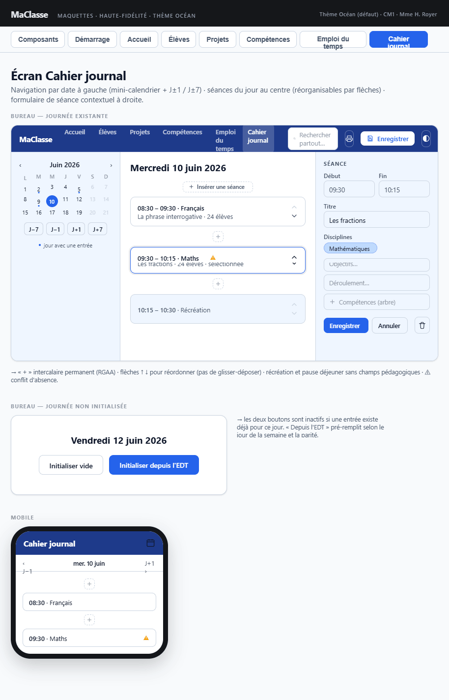

## Maquette

La maquette est antérieure à l'implémentation : elle montre un formulaire de séance dans une colonne de droite. L'écran implémenté a **deux zones** et ouvre le formulaire dans la liste des séances (voir ci-dessous).

---

## Layout général

Deux zones (une seule colonne empilée sous 768 px) :
- **Colonne gauche** (18rem) : navigation temporelle et actions de journée
- **Zone centrale** : contenu de la journée sélectionnée ; le formulaire de création ou de modification d'une séance s'ouvre **dans la liste**, à l'emplacement de la séance concernée

---

## Colonne gauche — Navigation et actions de journée

| Élément | Détail |
|---|---|
| Bouton **«** (J−7) | Recule d'une semaine |
| Bouton **‹** (J−1) | Recule d'un jour |
| Date courante | Format long (ex. « lundi 9 juin 2026 ») |
| Bouton **›** (J+1) | Avance d'un jour |
| Bouton **»** (J+7) | Avance d'une semaine |
| `mc-mini-calendrier` | Calendrier mensuel miniature ; met en évidence les jours ayant une entrée ; grise et désactive les week-ends, jours fériés et jours non ouvrés ; clic sur un jour → chargé dans la zone centrale |
| **DUPLIQUER LA JOURNÉE** | Si une journée existe ; ouvre le formulaire inline de duplication |
| **IMPRIMER** | Si une journée existe ; `window.print()` |
| **SUPPRIMER LA JOURNÉE** | Si une journée existe ; confirmation via `popin-avertissement` |
| Formulaire inline de duplication | Champ date « jour cible » + CONFIRMER / ANNULER ; sert à la duplication de journée **et** de séance |

- Navigation (flèches ou calendrier) : ferme le formulaire de séance ouvert
- **Bornage par les périodes scolaires** : le mini-calendrier reçoit `dateMin` = premier jour de la première période (`referentiels.periodes`, plus petite date de début) et `dateMax` = dernier jour de la dernière période (plus grande date de fin) ; sans période, aucune borne. Ces bornes limitent **seulement** la navigation entre les mois du calendrier (voir [composants-partages](../composants-partages.md#mc-mini-calendrier)) :
  - les boutons mois précédent / suivant sont désactivés sur le mois de la borne
  - dans ce mois, les jours hors période restent cliquables
  - les flèches **J−7 / J−1 / J+1 / J+7 ne sont pas bornées** : elles peuvent amener hors de l'année scolaire, et le calendrier suit alors la date affichée
- Le jour consulté est mémorisé dans `ContexteService.jourCourantCahierJournal` et rechargé à l'ouverture de l'écran

---

## Zone centrale — Journée sélectionnée

### Aucune entrée pour ce jour

Message « aucune séance » et deux boutons, **masqués** dès qu'une entrée existe :

| Bouton | Détail |
|---|---|
| **INITIALISER UNE JOURNÉE VIDE** (`btnInitialiserVidePrincipal`) | Crée une entrée vide pour ce jour |
| **INITIALISER DEPUIS L'EMPLOI DU TEMPS** (`btnInitialiserEdt`) | Pré-remplit la journée avec les créneaux de l'EDT applicable (jour de la semaine, parité) |

### En-tête

Une seule ligne (`cj__entete`) :
- `<h2 class="cj__titre-journee">` : date **en gras au format `JJ/MM/AAAA`** (`dateCourte`, via `DateUtils.formaterDateCourt`), affichée dès qu'une journée existe (même sans séance) — nécessaire à l'impression, la colonne gauche étant masquée en `@media print`
- Bouton de repli des notes (`btnBasculerNotes`, voir ci-dessous), si la zone de notes est affichable

### Notes de la journée

- Champ `notes?: string` sur `JourneeJournal` (mémo libre : rappels, événements, effectif…), indépendant des séances
- `mc-textarea` sous l'en-tête, **au-dessus de la liste des séances**, affichable dès qu'une séance existe **ou** que des notes sont déjà enregistrées (`@if (seances().length > 0 || notesJournee())`)
- **Repliable** : `<button id="btnBasculerNotes" aria-expanded aria-controls="zoneNotesJournee">` dans l'en-tête (chevron ▸/▾ + « Notes de la journée ») ; signal `notesDepliees`, **déplié à l'ouverture de l'écran**, non mémorisé. Replié, le `mc-textarea` sort du DOM et le bouton affiche en aperçu la première ligne des notes (`apercuNotes`, tronquée par une ellipse). Replier pendant la saisie déclenche d'abord le `focusout`, donc l'enregistrement
- Enregistrement **au blur** (`(focusout)` sur le `mc-textarea`) via `CahierJournalService.modifierNotesJournee(date, notes)` → `CommandeModification` (UNDO/REDO) ; le service **trim** la valeur (vide → `undefined`) et ignore l'appel si elle est inchangée
- Champ réactif `notesControl = new FormControl('', { nonNullable: true })` (Reactive Forms — pas de `ngModel`), resynchronisé par un `effect` (`setValue(..., { emitEvent: false })` + `cdr.markForCheck()`) sur `notesJournee()` — jamais pendant la frappe
- `notesJournee = computed(() => journeeSelectionnee()?.notes ?? '')` : version persistée, utilisée pour le `
` d'impression et la condition d'affichage
- Impression : un `
` (masqué à l'écran, rendu que les notes soient repliées ou non) remplace le textarea ; bascule gérée dans le `@media print` de `styles.scss` (`.cj__notes-saisie` et `.cj__bascule-notes` masqués, `.cj__notes-impression` affichée `white-space: pre-wrap`)
- **Pré-remplissage avec les absences du jour** : à l'initialisation d'une journée (vide ou depuis l'EDT), s'il y a au moins une absence ce jour-là, les notes reçoivent l'en-tête « Absences du jour (horaire entre parenthèses = récurrente, MAJUSCULES = ponctuelle) : » (`cahierJournal.enteteAbsencesJour`) suivi d'une ligne par élève absent, triée par élève : « - NOM Prénom : Orthophonie (10:00-10:45) ; SORTIE MÉDICALE ». Les absences récurrentes (jour de la semaine, parité compatible) viennent en premier, triées par heure, avec leur horaire ; les absences ponctuelles de la date suivent, en MAJUSCULES (`EleveService.genererLibellesAbsencesDuJour`, règle détaillée dans le [plan 17](../../plans/17-cahier-journal-regroupement-absences.md)). Les notes restent ensuite librement modifiables
- `dupliquerJournee` reporte les notes de la source vers la cible (création **et** remplacement) ; `dupliquerSeance` ne les touche pas (notes = niveau journée)
- Libellés : `cahierJournal.labelNotes`, `cahierJournal.placeholderNotes`, `commandes.modificationNotesJournee`

### Liste des séances

Séances triées par heure. Chaque séance est une ligne (`cj__ligne`, grille `1fr auto`) : sa carte, puis un bouton **+** hors de la carte, à droite.

#### Boutons « + »

- **Ligne de tête** (`btnAjouterSeanceDebut`) : ajoute une séance en début de journée (position 0) ; sur une journée sans séance, elle porte le message « aucune séance » et reste le seul moyen d'ajouter une séance
- **En bout de ligne** (`btnAjouterSeanceApres{id}`) : ajoute une séance **juste après** celle de la ligne (position `i + 1`)
- Chaque « + » est dans un cadre de même bordure et même arrondi que la carte, avec une infobulle ; visibles en permanence (RGAA), désactivés pendant une création ; masqués à l'impression
- Les heures proposées comblent l'écart entre les séances voisines (bornes de la journée scolaire de `configEmploiDuTemps` à défaut de voisine)

#### Séance en lecture seule

| Élément | Condition |
|---|---|
| Heure début – heure fin | Toujours |
| Type | Récréation / pause déjeuner uniquement (libellés `LIBELLES.edt.typeRecreation` / `typePauseDejeuner`) |
| Titre | Séance pédagogique, si renseigné |
| Icône warning ⚠ | Si `conflitDetecte` (champ dérivé persisté sur la séance : conflit avec une absence récurrente d'un élève concerné) |
| Pastilles élèves/groupes (`mc-pastilles-eleves-concernes`) | Séance pédagogique, si des élèves sont concernés |
| Objectifs | Séance pédagogique, si renseignés, sous l'en-tête de la carte |
| ↑ monter / ↓ descendre | Toujours ; désactivés respectivement sur la première et la dernière séance ; **échangent les heures** avec la séance voisine |
| ✎ modifier | Ouvre le formulaire de modification sous la séance ; la carte est surlignée |
| ⎘ dupliquer | Ouvre le formulaire inline de duplication (colonne gauche) pour cette séance |
| ✕ supprimer | Suppression immédiate (sans confirmation, annulable par UNDO) |

- Boutons ↑ ↓ ✎ ⎘ en `mc-btn-icone` (taille normale) ; ✕ en `mc-btn-icone mc-btn-xs mc-btn-danger` ; les cinq portent une infobulle (`[title]`, même libellé que l'`aria-label`)
- **Récréation et pause déjeuner** : affichées en **ligne fine** (`cj__seance--fine`) — sans bordure ni fond d'en-tête, « 10:30 – 10:45 · Récréation », actions et « + » conservés
- Les disciplines ne sont pas affichées dans la liste

#### Icône warning (triangle orange)

- Tabulable et cliquable (RGAA)
- Au clic : ouvre `popin-warnings-absences` listant les conflits (recalculés)
- `conflitDetecte` est recalculé à chaque **ENREGISTRER** d'une séance (`CahierJournalService.calculerConflitsPourSeance`) et enregistré avec elle ; s'il y a des conflits, la popin s'ouvre aussitôt (warning non bloquant). Il n'est pas recalculé si une absence récurrente est ajoutée ou modifiée ensuite dans la fiche élève

---

## Formulaire de séance (`cj-formulaire-seance`)

Inséré dans la liste : à la position d'insertion pour une création, sous la séance pour une modification. Un seul formulaire ouvert à la fois. Focus sur l'heure de début à l'ouverture (`focusDemande`).

### Boutons d'action

| Bouton | Comportement |
|---|---|
| **ENREGISTRER** | Ajoute ou modifie la séance via `CahierJournalService`, calcule les conflits d'absences (warning non bloquant), ferme le formulaire |
| **ANNULER** | Abandonne les saisies, ferme le formulaire |

La suppression se fait depuis la liste (✕), pas depuis le formulaire.

Messages d'erreur (`role="alert"`, `erreurFormulaireSeance`) : champs obligatoires manquants, plage horaire incohérente, élèves déjà concernés par une séance simultanée (voir Contrainte métier).

### Champs

| Champ | Composant | Condition |
|---|---|---|
| Heure de début | `mc-champ-heure` (obligatoire) | Toujours |
| Heure de fin | `mc-champ-heure` (obligatoire) | Toujours |
| Type | `mc-select` (pédagogique / récréation / pause déjeuner) | Toujours |
| Disciplines | Chips `mc-chip-filtre` (un par domaine de niveau 1) — sélection multiple | Type pédagogique |
| Titre | `mc-input` | Type pédagogique |
| Objectifs | `mc-textarea` | Type pédagogique |
| Déroulement | `mc-textarea` | Type pédagogique |
| Ressources | `mc-textarea` | Type pédagogique |
| Description | `mc-textarea` | Type pédagogique |
| Compétences | `mc-selecteur-competences` (multi-sélection) | Type pédagogique |
| Élèves concernés | `mc-eleves-concernes` | Type pédagogique |

**Élève absent ce jour-là** : en mode élèves, le chip d'un élève ayant une `AbsencePonctuelle` à la date de la journée est **désactivé**, avec la mention « absent ce jour » (`EleveService.listerIdsElevesAbsents` → input `elevesIndisponiblesIds` de `mc-eleves-concernes`). Un élève déjà sélectionné (absence saisie après la séance) reste retirable. Modes classe et groupes non concernés.

### Navigation avec formulaire modifié

L'écran implémente `AvecNavigationGardee` : quitter l'écran avec un formulaire de séance modifié ouvre une `popin-avertissement` (abandon ou retour).

---

## Duplication

Formulaire inline de la colonne gauche (champ date + CONFIRMER / ANNULER), ouvert par DUPLIQUER LA JOURNÉE ou par ⎘ sur une séance :
- **Séance** : copie la séance enregistrée vers le jour cible (`dupliquerSeance`)
- **Journée** : copie toutes les séances et les notes vers le jour cible (`dupliquerJournee`) ; une journée existante est **remplacée sans confirmation** (annulable par UNDO)
- Si aucune journée n'existe au jour cible, elle est créée

---

## Impression

- Bouton IMPRIMER de la colonne gauche → `window.print()`
- Colonne gauche, contrôles des séances, boutons « + » (dont la ligne de tête) et bouton de repli des notes masqués (`@media print`) ; les notes sont imprimées sous forme de paragraphe

---

## Contrainte métier

- Un élève ne peut pas être affecté à deux séances pédagogiques dont les plages horaires se chevauchent (chevauchement strict : des séances adjacentes sont autorisées). Mode classe = tous les élèves ; mode groupes = membres d'au moins un groupe sélectionné
- Contrôle **bloquant** à l'ENREGISTRER du formulaire (`CahierJournalService.detecterElevesSurSeancesSimultanees`) : message listant les élèves en cause, séance non enregistrée ; le message disparaît dès que le formulaire est modifié
- Récréations et pauses déjeuner ignorées ; la séance modifiée est exclue de la comparaison
- Non contrôlé : échange d'heures (↑ ↓), duplication de séance ou de journée, initialisation depuis l'EDT
