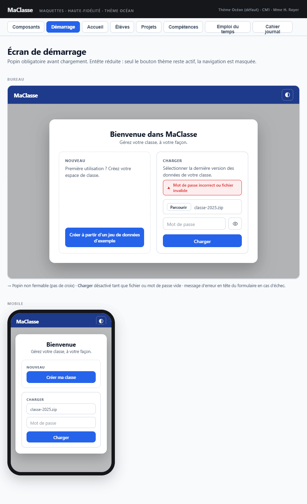

## Maquette

**Cohérence globale** : popin non fermable, layout mobile (sections empilées), message d'erreur rouge en haut du formulaire, champ fichier + mot de passe + bouton œil, bouton CHARGER désactivé si vide — tout correspond.

**Écarts avec la maquette** (la spécification fait foi) : la maquette montre deux zones ; l'écran en a trois (zone Référentiel de compétences). Le bouton de création a un libellé unique, sans variante mobile raccourcie.

---

## Contexte

Affiché au lancement de l'application (la route `/` redirige vers `/demarrage`) et quand un écran applicatif est demandé sans données chargées (`donneesChargeesGarde`).

---

## Entête

Toujours visible, même sans données chargées.

| Élément | État |
|---|---|
| Logo + titre "MaClasse" | Visible |
| Bouton changement de thème | **Actif** |
| Liens de navigation (écrans) | **Masqués** |
| Recherche globale | **Masquée** |
| Bouton SAUVEGARDER | **Masqué** |
| Boutons ANNULER / REFAIRE | **Masqués** |

---

## Popin de démarrage (`popin-demarrage`)

- **Obligatoire** : s'affiche automatiquement, non fermable (pas de croix, Échap sans effet)
- **Titre** (`<h1>`) : *« MaClasse »*
- **Sous-titre** : *« Bienvenue dans MaClasse — gérez votre classe, à votre façon. »*
- Zone de message d'erreur (`role="alert"`) sous le sous-titre, visible uniquement en cas d'erreur
- **Layout** : trois zones (cartes) côte à côte sur PC, empilées sur mobile, dans l'ordre Nouveau → Charger → Référentiel
- Focus initial sur le bouton de création

---

## Zone Nouveau

| Élément | Détail |
|---|---|
| Titre de zone | *« Première utilisation ? »* |
| Texte | *« Créez votre espace de classe à partir d'un jeu de données d'exemple. »* |
| Bouton **« Créer ma classe à partir d'un jeu de données d'exemple »** (`btnCreer`) | Charge `public/donnees-defaut.json` en recentrant le cahier journal sur la semaine suivante (voir [services](../services.md#charger)), puis navigue vers l'accueil |

Aucun mot de passe n'est connu après une création : la première sauvegarde ouvre `popin-sauvegarde`.

---

## Zone Charger

| Élément | Détail |
|---|---|
| Titre de zone | *« Sélectionner la dernière version des données de votre classe »* |
| Champ upload | Sélection d'un fichier ZIP chiffré (`fichierZip`, type `file`, accept `.zip`) derrière un bouton « Parcourir… » ; le nom du fichier choisi s'affiche à côté |
| Champ mot de passe | `motDePasseChargement`, label *« Mot de passe »* ; Entrée déclenche le chargement |
| Bouton œil | Afficher / masquer le mot de passe (bascule `type="password"` ↔ `type="text"`, `aria-pressed`) |
| Bouton **CHARGER** | Déchiffre le fichier via `ChiffrementService.dechiffrer()` |

### Comportement du bouton CHARGER

- **Désactivé** si le champ fichier ou le mot de passe est vide
- **Au clic** (si fichier et mot de passe renseignés) :
  - Les boutons et champs de la popin sont **désactivés** (évite le double-clic)
  - Le libellé du bouton devient **« Chargement… »** pendant le déchiffrement (pas de spinner)
- En cas d'erreur : message en haut de la popin, boutons réactivés, la popin reste affichée :

| Cas | Message |
|---|---|
| Mot de passe incorrect | *« Mot de passe incorrect. »* |
| Fichier invalide ou corrompu | *« Fichier invalide ou corrompu. »* |
| Fichier créé par une version plus récente (`MigrationService.estVersionSupportee`) | *« Ce fichier a été créé avec une version plus récente de MaClasse. Veuillez mettre à jour l'application. »* |

- En cas de succès :
  - Mot de passe conservé en mémoire dans `ContexteService.motDePasse` (pour les sauvegardes)
  - Données chargées dans `DonneesService` **sans modifier les dates**
  - Navigation vers l'écran d'accueil
  - Démarrage de la sauvegarde automatique (voir [vue-ensemble](vue-ensemble.md#sauvegarde-automatique))

---

## Zone Référentiel de compétences

Permet de consulter les programmes de l'Éducation nationale sans créer ni charger de classe.

| Élément | Détail |
|---|---|
| Titre de zone | *« Référentiel de compétences »* |
| Texte | *« L'application contient un référentiel des compétences issues des BO de l'EN. »* |
| Bouton **« Accéder aux programmes »** (`btnAccederReferentiel`) | Charge les données d'exemple, active `ContexteService.modeConsultationReferentiel` et navigue vers l'écran Compétences |

**Mode consultation du référentiel :**
- Seul l'écran [Compétences](competences.md) est accessible : la garde `referentielSeulGarde` renvoie vers `/demarrage` toute autre route
- L'entête désactive tous les liens sauf Compétences (tooltip explicatif, `aria-disabled`) et masque la recherche, SAUVEGARDER, ANNULER et REFAIRE (voir [vue-ensemble](vue-ensemble.md#état-de-lentête))
- Le mode est désactivé dès qu'une classe est créée ou chargée depuis la popin

---

## Pendant le chargement (toutes les zones)

- Les trois boutons sont désactivés et affichent *« Chargement… »* (le bouton CHARGER, les deux autres boutons avec `LIBELLES.commun.chargement`)
- La navigation vers l'écran cible est immédiate une fois les données chargées ; la popin disparaît avec l'écran de démarrage
