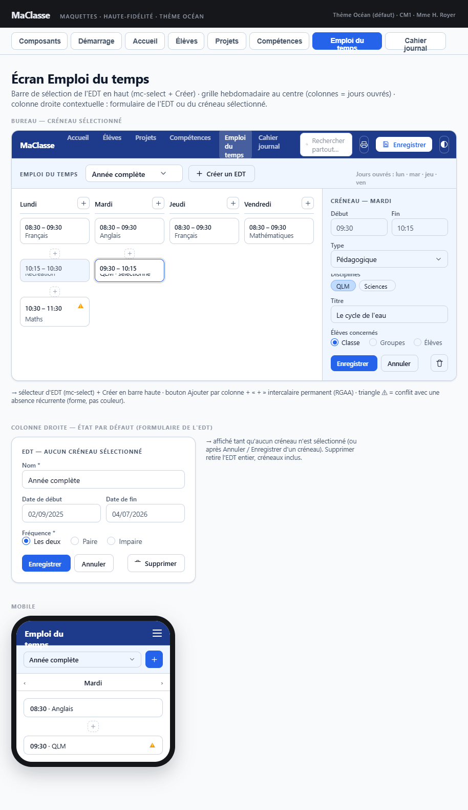

## Maquette

**Cohérence globale** : 3 colonnes (liste des EDT, grille hebdomadaire par jours ouvrés, formulaire contextuel EDT ou créneau), icône warning sur créneaux conflictuels, boutons ENREGISTRER / ANNULER / SUPPRIMER dans le formulaire — tout correspond.

**Select d'EDT** : la maquette utlise un `mc-select` en haut de la colonne gauche pour choisir l'EDT actif par son nom ("Semaine complète" dans l'exemple) — Ceci n'est pas cohérent avec la spécification. La spécification fait foi.

---

## Layout général

Trois colonnes — homogène avec les autres écrans :
- **Colonne gauche** : liste des EDT + bouton CRÉER
- **Zone centrale** : grille hebdomadaire de l'EDT sélectionné
- **Colonne droite** : formulaire contextuel (propriétés EDT ou créneau)

---

## Colonne gauche — Liste des EDT

### Bouton CRÉER

- Positionné en haut de la colonne
- Crée un EDT vide, le sélectionne dans la liste, ouvre ses propriétés dans la colonne droite

### Liste des EDT

- Affiche pour chaque EDT : **nom** + **fréquence** (paire / impaire / les deux) + plage de dates si renseignée
- Clic sur un EDT → charge sa grille dans la zone centrale + ouvre ses propriétés dans la colonne droite
- **Icône warning ⚠** sur un EDT si son chevauchement avec un autre EDT est détecté (même plage de dates ET même parité)
  - Tabulable et cliquable (RGAA)
  - Au clic : ouvre `popin-warnings-absences` listant le ou les EDT en conflit

---

## Zone centrale — Grille hebdomadaire

Affichée uniquement quand un EDT est sélectionné dans la colonne gauche.

### En-tête de la zone centrale

- Nom de l'EDT affiché et bouton **IMPRIMER** (voir plus bas)

### Bandeau des absences régulières

- Placé en tête de la **zone centrale uniquement**, entre l'en-tête (nom + IMPRIMER) et la grille ; les colonnes gauche et droite ne sont pas concernées
- Affiché si un EDT (non calculé) est sélectionné et qu'au moins une absence récurrente d'élève est pertinente pour lui (jour ouvré utilisé + parité compatible)
- **Repliable** : le titre « Absences régulières sur cette période » est un bouton (`btnBasculerAbsences`, `aria-expanded`, `aria-controls`) précédé d'un chevron ▾ / ▸
  - Déplié à l'arrivée sur l'écran ; l'état n'est pas mémorisé
  - Déplié : une ligne par absence — « NOM Prénom — libellé (Jour hh:mm-hh:mm) »
  - Replié : la liste est masquée, le bouton affiche le nombre d'absences (« — 3 »)
- Non imprimé

### Structure

- **Colonnes** : jours ouvrés (`referentiels.configEmploiDuTemps.joursOuvres`)
- **Lignes** : créneaux de l'EDT sélectionné, triés par heure de début ascendante
- Créneaux libres (pas de lignes horaires fixes prédéfinies)

### En-tête de colonne (par jour)

| Élément | Détail |
|---|---|
| Nom du jour | Ex. "Lundi" |
| Bouton **AJOUTER** | Crée un créneau vide en fin de liste pour ce jour, l'ouvre dans la colonne droite |

### Bouton intercalaire "+"

- Visible en permanence entre chaque créneau de la colonne (RGAA)
- Au clic : crée un créneau vide inséré à cette position, l'ouvre dans la colonne droite

### Cellule de créneau (lecture seule dans la grille)

| Élément | Condition |
|---|---|
| Heure début – heure fin | Toujours |
| Type | Toujours (pédagogique / récréation / pause déjeuner) |
| Titre | Type pédagogique |
| Disciplines | Type pédagogique |
| Icône warning ⚠ | Si conflit avec une absence récurrente d'un élève |

#### Icône warning créneau (triangle orange)

- Tabulable et cliquable (RGAA)
- Au clic : ouvre `popin-warnings-absences` listant les conflits du créneau
- Calculé à l'**ouverture** de l'écran et au **chargement d'un EDT** dans la grille

---

## Colonne droite — Formulaire contextuel

Vide si aucun EDT n'est sélectionné. Pas de mode lecture intermédiaire — toujours en mode formulaire.

### État 1 : propriétés de l'EDT sélectionné

Affiché au clic sur un EDT dans la colonne gauche, ou après ANNULER/ENREGISTRER d'un créneau.

#### Boutons d'action

| Bouton | Comportement |
|---|---|
| **ENREGISTRER** | Soumet la commande à `DonneesService` |
| **ANNULER** | Restaure les valeurs initiales de l'EDT |
| **SUPPRIMER** | `mc-bouton-destruction` : supprime l'EDT et tous ses créneaux |

#### Champs

| Champ | Composant | Obligatoire |
|---|---|---|
| Nom | `mc-input` | Oui |
| Date de début | `mc-input` type date | Non |
| Date de fin | `mc-input` type date | Non |
| Fréquence | `mc-radio-group` (paire / impaire / les deux) | Oui |

---

### État 2 : formulaire d'un créneau

Affiché au clic sur une cellule ou sur un bouton AJOUTER / intercalaire "+".

#### Boutons d'action

| Bouton | Comportement |
|---|---|
| **ENREGISTRER** | Soumet la commande à `DonneesService`, revient à l'état 1 (propriétés EDT) |
| **ANNULER** | Abandonne les saisies, revient à l'état 1 |
| **SUPPRIMER** | `mc-bouton-destruction` : supprime le créneau, revient à l'état 1 |

#### Champs

| Champ | Composant | Condition |
|---|---|---|
| Heure de début | `mc-champ-heure` | Toujours |
| Heure de fin | `mc-champ-heure` | Toujours |
| Type | `mc-select` (pédagogique / récréation / pause déjeuner) | Toujours |
| Disciplines | Chips sélectionnables (un chip par domaine de niveau 1) — sélection multiple | Type pédagogique |
| Titre | `mc-input` | Type pédagogique |
| Élèves concernés | `mc-eleves-concernes` | Type pédagogique |

---

## Bouton IMPRIMER

- Positionné en haut de la zone centrale, à droite du nom de l'EDT affiché
- Déclenche l'impression via le navigateur (`window.print()`) ; tout ce qui suit s'applique aussi à Ctrl+P
- **Seule la grille est imprimée** : colonne gauche, colonne droite, bandeau des absences, icônes de conflit, boutons « + » et ligne AJOUTER sont masqués (`@media print` de `styles.scss`)
- **Orientation paysage** imposée (A4, marges 10 mm) via la page nommée `edt-paysage`, propre à cet écran
- **Page unique** : au `beforeprint`, la grille est mesurée à la largeur imprimable et réduite par un facteur `zoom` ≤ 1 (variable CSS `--edt-echelle-impression`) pour tenir en hauteur ; facteur remis à 1 au `afterprint`
- **Titre du document** (`document.title`) remplacé pendant l'impression, puis restauré. Il apparaît dans l'en-tête d'impression du navigateur et comme nom du PDF proposé :

| Dates renseignées | Titre |
|---|---|
| Début et fin | `nom (01/09/2026-18/10/2026 / Semaines paires)` |
| Début seul | `nom (à partir du 01/09/2026 / Semaines paires)` |
| Fin seule | `nom (jusqu'au 18/10/2026 / Semaines paires)` |
| Aucune | `nom (Semaines paires)` |

S'applique aussi aux EDT calculés. Sans EDT affiché, le titre n'est pas modifié.

---

## Référentiel EDT

Les jours ouvrés et horaires de début/fin de journée sont configurés dans l'**écran de paramétrage** (section Semaine & Horaires).
